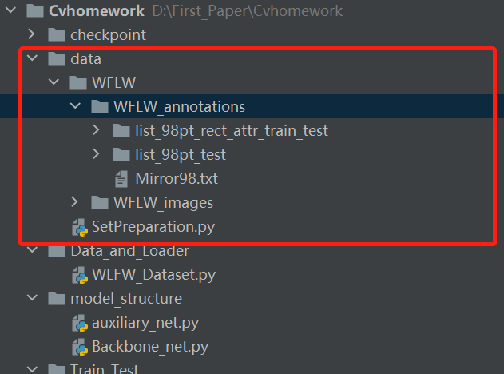
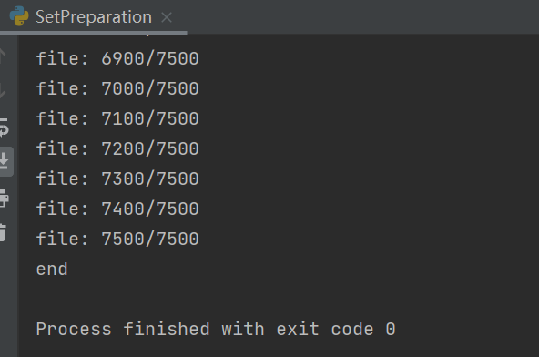
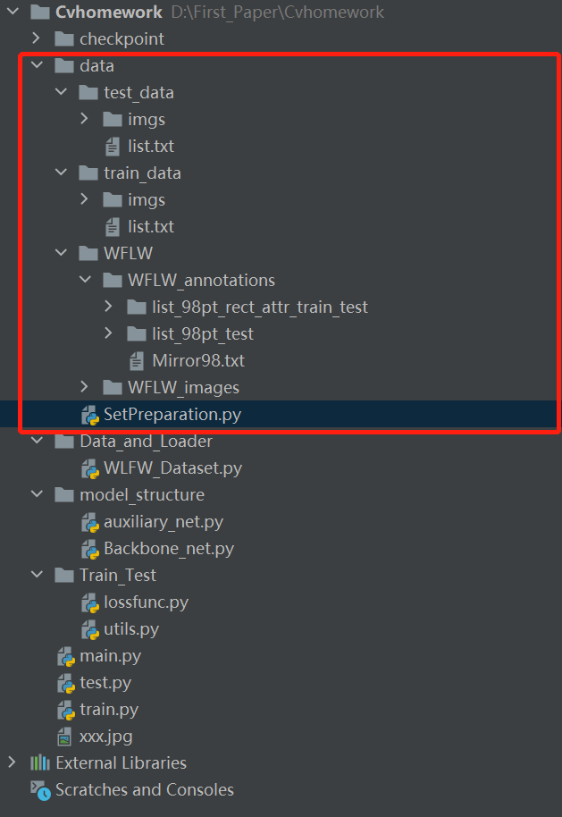
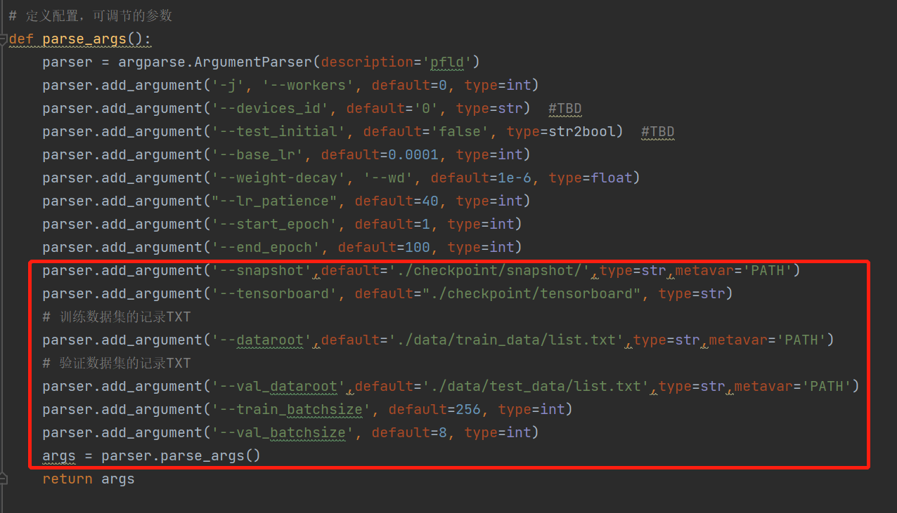
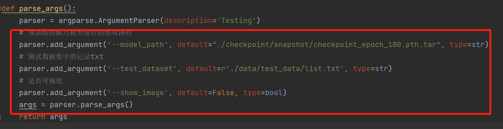
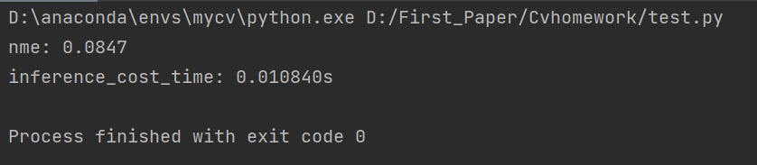

# Cvhomework
请下载整个文件的压缩包

#### 安装库
使用
~~~shell
$ pip install 库
~~~
需要安装的库：
~~~shell
torch
torchvision
argparse
time
opencv-python
tensorboardX 
os
logging
numpy
sys
random
shutil
typing
~~~

#### 下载WFLW数据集

1. WFLW 训练和测试图片 [[Google Drive](https://drive.google.com/file/d/1hzBd48JIdWTJSsATBEB_eFVvPL1bx6UC/view?usp=sharing)] [[Baidu Drive](https://pan.baidu.com/s/1paoOpusuyafHY154lqXYrA)]
2. WFLW  [Face Annotations](https://wywu.github.io/projects/LAB/support/WFLW_annotations.tar.gz)
3. 将这两个文件解压并放在路径 `./data/WFLW/`
4. 把 `Mirror98.txt` 移到 `WFLW/WFLW_annotations`
- 得到如下图的文件结构
- 

#### 划分WFLW数据集，换一台电脑或将项目换路径后必须重新运行一次
- 然后运行下面的代码
~~~shell
$ cd data # cd 到Cvhomework/data 路径下，建议使用绝对路径
$ python3 SetPreparation.py
~~~
- 运行结束
- 
- 最终得到如下图的文件结构
- 
#### 训练和测试

- 训练:
- 默认训练一百个epoch，会保存每一个epoch的数据和模型，请注意存储空间
- 训练前，请根据实际情况修改如下图的相关配置
- 
~~~shell
$ cd Your_path/Cvhomework 这里是cd到这个项目的总路径下，建议使用绝对路径
$ python3 train.py
~~~
- 本项目已经提供了训练好的模型，可以直接测试
- 测试:
- 测试前，请根据实际情况修改如下图的相关配置
- 
~~~shell
$ cd Your_path/Cvhomework 这里是cd到这个项目的总路径下，建议使用绝对路径
$ python3 test.py
~~~

- 测试完后输出nme和平均的运行时间
- 
